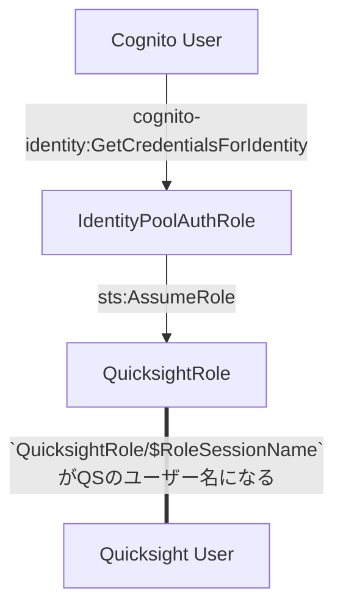
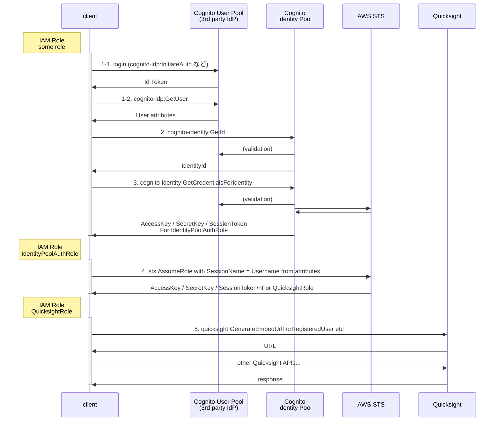

## はじめに

Cognito と Quicksight を連携する方法があまりネットに情報がなかったので、自分が試した方法をまとめて見ます。


## 前提

* Quicksight の認証周りの基礎知識
* Cognito の User Pool / Identity Pool 周りの基礎知識


## 実現したいこと

あるアプリでユーザー管理には Cognito の User Pool を利用しているとしましょう。
この Cognito のユーザーごとに、 Quicksight のユーザーを作成し、ユーザーに応じて適切なダッシュボードを見せられるようにしたいです。これを実現する方法を考えていきます。

より具体的に設定を記載すると、 Cognito のユーザーは Custom User Attribute として `custom:appUserId` を持っており、ユーザーを一意に特定するのに使えるとします。これをうまく利用して、このユーザーIDごとに Quicksight にユーザーをうまく作る方法を考えたいです。


## 今回の手法を利用する上で大事なトピック

### Quicksight の IAM Role による認証

IAM Role を認証に使った場合、 Quicksight のユーザーは `<RoleName>/<RoleSessionName>` の形式で命名されます。


### Cognito の GetCredentialsForIdentity

`GetCredentialsForIdentity` を利用すると、 Identity Pool の認証済みロールの認証情報を簡単に取得できます。注意点としてその際に `RoleSessionName` は **`CognitoIdentityCredentials`で固定されてしまいます**。
そのため、 Identity Pool の認証済みロールをそのまま Quicksight の認証に使おうとすると、 User Pool のユーザー全員が同じ Quicksight のユーザーを使うことになってしまうので困るわけです。


### ABAC

Attribute Based Access Control の略で、属性ベースアクセス制御のこと。

ABAC の設定を行うと IAM Policy 内で `"${aws:PrincipalTag/someAttributes}"` というような記載が利用でき、ユーザーの属性に応じて権限の制御が可能になります。

https://docs.aws.amazon.com/ja_jp/IAM/latest/UserGuide/introduction_attribute-based-access-control.html

https://docs.aws.amazon.com/ja_jp/IAM/latest/UserGuide/reference_policies_condition-keys.html#condition-keys-principaltag


### Cognito Identity Pool と ABAC

Cognito Identity Pool には "Attributes for access control" という機能があり、これを利用すると Cognito のユーザーの属性に基づいてアクセスの制御（つまり ABAC）が実現できます。

マネジメントコンソールであれば Identity Pool の "Attributes for access control" のセクションから、 CDKであれば `CfnIdentityPoolPrincipalTag` を利用すれば設定可能です。

https://docs.aws.amazon.com/ja_jp/cognito/latest/developerguide/attributes-for-access-control.html


https://docs.aws.amazon.com/cdk/api/v2/docs/aws-cdk-lib.aws_cognito.CfnIdentityPoolPrincipalTag.html


## 実現方法

上記のトピックを適宜組み合わせることで Cognito ユーザーと Quicksight ユーザーを紐づけることができます。


### 登場人物とその関係

Quicksight の認証をするまでに出てくる登場人物と、流れを簡単に整理します。



* Cognito User
  * アプリで利用しているユーザー
  * Custom User Attribute として `custom:appUserId` があり、これでユーザーを一意に特定可能
* IAM Role : `IdentityPoolAuthRole`
  * Cognito User が利用できる Identity Pool の認証済みロール
  * 次の `QuicksightRole` へ Assume Role する権限だけを持つように Identity Based Policy は設定
* IAM Role : `QuicksightRole`
  * Quicksight の認証に使うロール
    * Assume Role できるのは `IdentityPoolAuthRole` が RoleSessionName に `appUserId` を指定した時だけ、と設定
    * Assume Role Policy は以下のようなイメージ
        ```json:QuicksightRole_assume-role-policy.json
        {
            "Version": "2012-10-17",
            "Statement": [
                {
                    "Effect": "Allow",
                    "Principal": {
                        "AWS": "arn:aws:iam::123456780912:role/IdentityPoolAuthRole"
                    },
                    "Action": "sts:AssumeRole",
                    "Condition": {
                        "StringEquals": {
                            "sts:RoleSessionName": "${aws:PrincipalTag/appUserId}"
                        }
                    }
                }
            ]
        }
        ```
    * この ABAC の設定により、**ある Cognito ユーザーが別の Cognito ユーザーになりすまして Quicksight のダッシュボードを閲覧したりすることを防ぐことができます。**
  * `quicksight:GenerateEmbedUrlForRegisteredUser` など Quicksight の API を叩けるように Identity Based Policy は設定
* Quicksight User
  * `QuicksightRole` を認証に利用した場合、ユーザー名は `QuicksightRole/<RoleSesssionName>` となる


### 実際の流れ

認証までの流れは以下の通りです。

* Client 側ではまず通常利用の権限で以下を取得する
  *  `cognito-idp:GetUser` で `custom:appUserId` を取得
  *  `cognito-identity:GetId` で `IdentityId` を取得
* `IdentityId` をインプットに、 `cognito-identity:GetCredentialsForIdentity` を実行し、 Identity Pool の認証済みロール `IdentityPoolAuthRole` の認証情報を取得する
* `IdentityPoolAuthRole` で、 Quicksight の認証に利用する `QuicksightRole` へ Assume Role する
  * **その際に `RoleSessionName` は `custom:appUserId` を指定する**
* `QuicksightRole` で Quicksight の API を適宜叩く
  * 例えば `quicksight:GenerateEmbedUrlForRegisteredUser` で登録済みユーザー向けの埋め込みダッシュボードのURLを取得するなど


### シークエンス図

より具体的なシークエンス図にするとこんな感じです。




## 他の方法

DevelopersIO の以下の記事などがありますが、 API Gateway や Lambda など管理すべきものが増えるので、今回の方法を考えました。
https://dev.classmethod.jp/articles/mapping-to-amazon-quicksight-user-based-on-amazon-cognito-identity-token/


## まとめ

Cognito のユーザーと Quicksight のユーザーを紐づける方法を紹介しました。
Identity Pool の Attributes for access control を適切に使い ABAC することで安全に紐付けができます。


## Reference


AWS Black Belt : Amazon QuickSight におけるシングルサインオンの設計と実装
https://pages.awscloud.com/rs/112-TZM-766/images/AWS-Black-Belt_2023_AmazonQuickSight-SSO_0228_v1.pdf